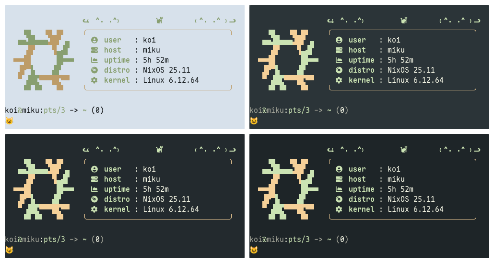
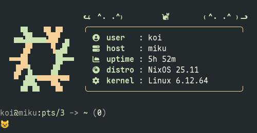
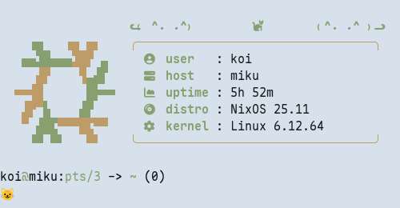

<h3 align="center">
   
  Evergarden for <a href="https://codeberg.org/dnkl/foot">Foot</a>
</h3>

  
  
  

  

### Previews

  
Winter

  

  
Fall

  

  
Spring

  

  
Summer

  

### Usage

Copy contents of your preferred flavor & accent color from <themes> into your Foot configuration file.

### Thanks to <3

- [koi](https://codeberg.org/koibtw)
- [robin](https://codeberg.org/comfysage)

  

